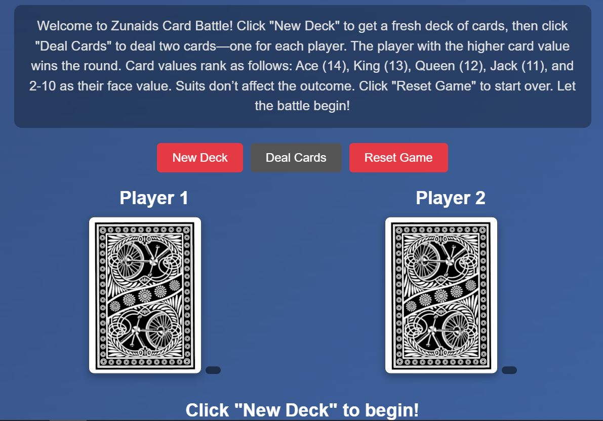

# Card Battle 🃏  
A fun two-player card game where players draw cards from an API and battle for the highest card. Built with vanilla JavaScript, styled with CSS, and powered by the Deck of Cards API.

**Link to project:** https://zunaid990.github.io/zunaids-card-battle/ 

---

## How It's Made:

**Tech used:** HTML, CSS, JavaScript, Deck of Cards API

This project uses HTML to structure the game UI, CSS for layout and responsive design (with a sprinkle of animations), and JavaScript to handle all logic and API interactions. When users click the "Deal Cards" button, it fetches two cards from the Deck of Cards API and compares their values. The card with the higher rank wins the round.
 Card values: Ace (14), King (13), Queen (12), Jack (11), 2–10 (face value).
The app includes:
- A "New Deck" button to reset the game with a fresh shuffled deck.
- A "Deal Cards" button to draw two new cards.
- A live display of card images and round results.
- A "Reset Game" button to start fresh.

---

## Optimizations  
*(optional)*  
- Used `async/await` for cleaner API calls.
- Separated logic into modular functions.
- Made the layout mobile-responsive using Flexbox and media queries.
- Minimized DOM queries for performance.

---

## Lessons Learned:

This project helped me understand how to work with third-party APIs and real-time data handling using `fetch()`. I also gained experience managing game state, improving UI responsiveness, and debugging async behavior in the browser.

It was rewarding to see the project evolve into a fully playable mini-game!